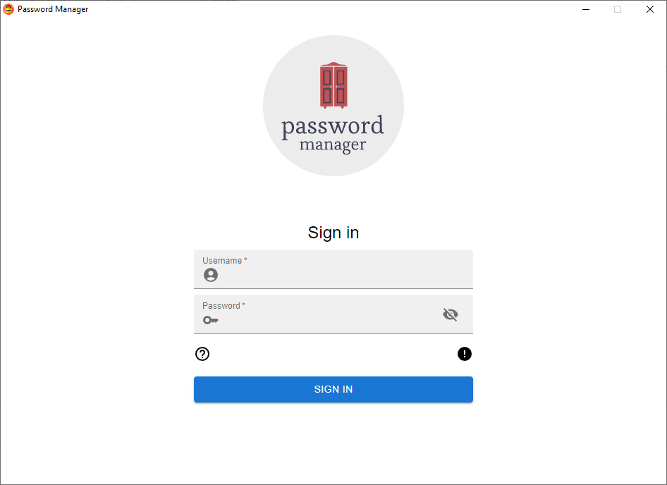

# Password-Manager

<!---Esses são exemplos. Veja https://shields.io para outras pessoas ou para personalizar este conjunto de escudos. Você pode querer incluir dependências, status do projeto e informações de licença aqui--->




# [README - PT/BR](README_PTBR.md)

> Password-Manager is a desktop app that manages, creates and saves your passwords in an encrypted database.

## About the project

Password-Manager uses your username and password to generate an encryption key which is used to encrypt the database.<br>
The project was created for learning purposes. Contribuitions are *greatly appreciated*.


### Built with
* [![React][React.js]][React-url]
* [![Electron][Electron.js]][Electron-url]
* [better-sqlite3-multiple-ciphers](https://github.com/m4heshd/better-sqlite3-multiple-ciphers)
* [generate-password](https://github.com/brendanashworth/generate-password)
* [electron-react-boilerplate](https://github.com/electron-react-boilerplate/electron-react-boilerplate)

## Roadmap

The project is still in development and the next updates will be focused on the following tasks:

- [ ] Sync database in cloud (ex: DROPBOX/GOOGLE DRIVE)
- [ ] Dark theme

## Prerequisites

* npm
  ```sh
  npm install npm@latest -g
  ```

## Installation

1. Clone repository
    ```sh
    git clone https://github.com/kenzotmg/Password-Manager
    cd password-manager
    ```
2. Install npm packages
    ```sh
    npm install
    ```
3. Run
    ```sh
    npm start
    ```

## How to contribute
<!---Se o seu README for longo ou se você tiver algum processo ou etapas específicas que deseja que os contribuidores sigam, considere a criação de um arquivo CONTRIBUTING.md separado--->
1. Fork this repository.
2. Create a branch: `git checkout -b <brach_name>`.
3. Make your changes and commit: `git commit -m '<commit_message>'`
4. Push it: `git push origin password-manager / <local>`
5. Create a pull request.

See official documentation on [how to create a pull request](https://help.github.com/en/github/collaborating-with-issues-and-pull-requests/creating-a-pull-request).

## 📝 License

This project is open-source and is under the [MIT](LICENSE.md) license.


[React.js]: https://img.shields.io/badge/React-20232A?style=for-the-badge&logo=react&logoColor=61DAFB
[React-url]: https://reactjs.org/
[Electron.js]: https://img.shields.io/badge/-Electron-61DAFB?style=for-the-badge&logo=Electron&logoColor=20232A
[Electron-url]: https://www.electronjs.org
